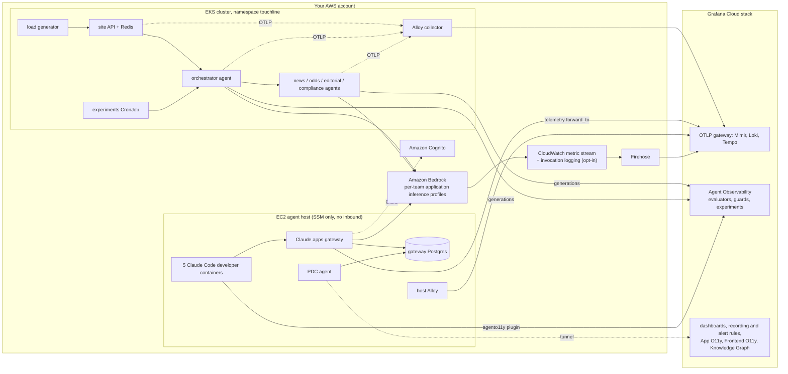

# grafana-aio11y-demo

A self-contained demo of AI observability on Grafana Cloud, built around **Touchline Times**, a
fictional sports newspaper that publishes match news, betting odds and bookmaker offers. One
`terraform apply` into your own AWS account, EKS cluster and Grafana Cloud stack stands up the
whole thing; one `terraform destroy` removes it.

This is a personal demo project, not an official Grafana Labs product.

## What it demonstrates

### In-app agents on Amazon Bedrock

The Touchline site has an AI match desk: an orchestrator
routes a reader question to news, odds, editorial and compliance agents, which call shared tools
(odds, news, head-to-head history, offers) and answer through Bedrock. Every call is traced with
OpenTelemetry and recorded as a generation in Grafana Agent Observability, with online
evaluations (groundedness, PII, responsible-gambling language), a prompt-injection guard on tool
results and scheduled experiments comparing prompt variants and models.

### Claude Code developers through the Claude apps gateway

Five developers in three teams
(newsroom, trading, platform) run Claude Code in containers on one EC2 host. They sign in to the
Claude apps gateway with Amazon Cognito, and the gateway holds the Bedrock credential, decides
which models each team can use, enforces per-organization, per-team and per-developer spend caps,
and pushes managed settings: OpenTelemetry export, MCP servers and the Agent Observability plugin.
The plugin sends every prompt and tool call through Cloud guards (a PII deny guard, secret and
PII redaction, content safety) and makes sessions available to online evaluations.

### Bedrock's own view

A CloudWatch metric stream sends the `AWS/Bedrock` namespace to Grafana
Cloud Metrics, and optional model invocation logging sends Bedrock's per-call log to Grafana Cloud
Logs. Per-team application inference profiles make AWS-side attribution possible without the
gateway.

### Everything in one Grafana Cloud stack

There are four dashboards (in-app agents, Bedrock, Claude Code, the gateway), and each tab is
labelled by the data source behind it. Grafana-managed recording and alert rules cover spend,
guard denies, errors, latency and throttling, and route through simplified routing to a contact
point that pages nobody. A spend datasource reads the gateway's own Postgres through Private Data
source Connect. Application Observability, Frontend Observability for the site and a Knowledge
Graph rule that joins the services complete the stack.

## Architecture



More detail in [docs/architecture.md](docs/architecture.md).

## Prerequisites

Short version; [docs/prerequisites.md](docs/prerequisites.md) has every scope and switch.

- A Grafana Cloud stack with Agent Observability enabled and its LLM-judge provider pointed at
  Bedrock, the Knowledge Graph initialized, and the simplified-routing and Grafana-managed
  recording rule features available.
- Three Grafana credentials: a Cloud access policy token (access policies, stacks), a Frontend
  Observability token, and an Admin service account token on the stack.
- An AWS account with Bedrock model access for the Anthropic models (including Anthropic's one-time
  use-case form), cross-region inference profiles allowed by your SCPs, and permission to create
  IAM roles, Cognito, EC2, Secrets Manager, Firehose and CloudWatch resources.
- An EKS cluster with the Pod Identity agent (built in on Auto Mode), or use
  [examples/eks-auto-mode](examples/eks-auto-mode) to create one, plus a subnet with NAT for the
  agent host.
- Tools: OpenTofu 1.8+ or Terraform 1.8+, the AWS CLI with the Session Manager plugin, `helm`,
  `kubectl` and [`just`](https://github.com/casey/just).

## Quickstart

About ten minutes of typing. EKS cluster creation alone usually takes 10 to 15 minutes of waiting.
The commands use `tofu`; `terraform` works the same way.

```bash
git clone https://github.com/rknightion/grafana-aio11y-demo
cd grafana-aio11y-demo

# 1. A VPC and an EKS Auto Mode cluster (skip if you bring your own cluster)
tofu -chdir=examples/eks-auto-mode init
tofu -chdir=examples/eks-auto-mode apply

# 2. The demo, against that cluster
cp examples/complete/terraform.tfvars.example examples/complete/terraform.tfvars
tofu -chdir=examples/eks-auto-mode output -raw agent_host_subnet_id   # paste into terraform.tfvars
$EDITOR examples/complete/terraform.tfvars                             # stack slug and URL, region

export TF_VAR_grafana_cloud_access_policy_token=...        # or put them in terraform.tfvars
export TF_VAR_grafana_frontend_o11y_api_access_token=...
export TF_VAR_grafana_stack_service_account_token=...

tofu -chdir=examples/complete init
tofu -chdir=examples/complete apply

# 3. Open the dashboards
tofu -chdir=examples/complete output dashboards
```

With an existing cluster, skip step 1. Set `cluster_name` and a NAT-routed `agent_host_subnet_id` in
`terraform.tfvars`, make sure your AWS credentials can reach the cluster API (the example
authenticates with `aws eks get-token`), and run step 2.

After apply, the in-cluster agents start serving load generator traffic straight away. The agent
host boots, installs the pinned Claude Code release, and its login bot signs each developer in to
the gateway. Developers then start a session every 20 minutes on average, so give the Claude Code
and gateway dashboards about half an hour before presenting. If a developer does not sign in, run
`just login-developers` (see [docs/coding-agents.md](docs/coding-agents.md)).

To look at the site: `kubectl -n touchline port-forward svc/touchline-site-api 8080:8080`, then
open http://localhost:8080.

## Cost

Rough on-demand estimates for the defaults in `eu-west-1`, with 730 hours a month. Check the AWS
pricing calculator for your region before relying on them.

| Item | Default | Approximate cost |
|---|---|---|
| EKS control plane | one cluster | USD 0.10/hour, about USD 73/month |
| EKS Auto Mode compute | agents, site, Redis, Alloy (about 0.5 vCPU and 1.9 GiB requested) | one or two small nodes plus the Auto Mode management fee, roughly USD 50 to 110/month |
| Agent host | `t4g.xlarge`, 60 GB gp3 | about USD 110/month |
| NAT gateway | one, from `examples/eks-auto-mode` | about USD 35/month plus USD 0.048 per GB processed |
| Secrets Manager, Firehose, metric stream, Cognito (5 users), CloudWatch | | a few USD/month |
| Bedrock, in-app agents | load generator at 2 questions/minute, its own daily budget guard (chart value `loadgen.dailyBudgetUsd`, USD 5/day by default) | usually well under the guard; a typical question costs under one US cent |
| Bedrock, Claude Code developers | 5 developers, a session every 20 minutes each, USD 0.30 hard budget per session | capped by the gateway: USD 20/day per developer by default, USD 5/day for the trading team, USD 2/day for one platform developer; so at most about USD 52/day |
| Bedrock, LLM-judge evaluations | 10 to 25% sampling on Haiku | small next to the traffic itself |
| Grafana Cloud | | see below |

Fixed infrastructure is roughly USD 280 to 340 a month. Bedrock is the variable part and,
with traffic on all day, usually the biggest.

`traffic_enabled = false` is the kill switch. It stops the developer sessions, the load generator and the
experiment schedule without removing anything; Bedrock spend then drops to near zero while the
dashboards keep their history. This knob lives in the agent-host secret, not the host's user data,
so the host picks it up within 5 minutes without being replaced. `agent_host_enabled = false`
removes the host.

On Grafana Cloud, a free stack is enough to try the demo for a short time, but full content
capture (prompts, responses and tool content in logs) and Claude Code's per-session metric series
grow quickly. For a demo you leave running for days, use a paid or trial stack and watch the
stack's usage dashboards. Agent Observability, Frontend Observability and Application
Observability are billed under their own usage terms.

## Teardown

```bash
tofu -chdir=examples/complete destroy
tofu -chdir=examples/eks-auto-mode destroy
```

Destroy the demo before the cluster. A few things outlive destroy or need a manual check (KMS keys pending deletion, invocation
logging, Application Observability): see
[docs/teardown.md](docs/teardown.md).

## Documentation

- [Architecture](docs/architecture.md): components, data paths, naming
- [Prerequisites](docs/prerequisites.md): Grafana Cloud, AWS and tool setup in detail
- [Data sources](docs/data-sources.md): what each telemetry tier sees, mapped to dashboard tabs
- [Demo runbook](docs/demo-runbook.md): a presenter flow with what to click and what to say
- [Coding agents](docs/coding-agents.md): the agent host, sign-in, developers, teams and spend caps
- [Deploy alternatives](docs/deploy-alternatives.md): Argo CD, Flux or kubectl for the workloads
- [Security](docs/security.md): content capture, tokens in state, exposure, guard scope
- [Troubleshooting](docs/troubleshooting.md)
- [Teardown](docs/teardown.md)

Component READMEs: [the module inputs](terraform/variables.tf),
[the Helm chart](charts/touchline/README.md), [the agent host](agent-host/README.md),
[the agents](apps/agents/README.md), [the site](apps/site/README.md),
[the MCP tools](apps/mcp-tools/README.md).

## Licence

Apache-2.0, see [LICENSE](LICENSE).
