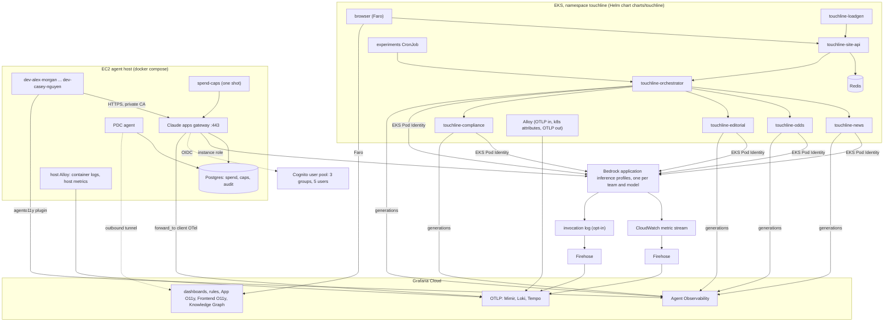

# Architecture

The demo has three halves that share one Grafana Cloud stack: the in-cluster Touchline Times app
and its AI agents, an EC2 host that plays a small engineering team using Claude Code through the
Claude apps gateway, and Bedrock's own telemetry. One Terraform module (`terraform/`) creates all
of it, except the EKS cluster, which you bring or create with
[examples/eks-auto-mode](../examples/eks-auto-mode).

## In the cluster

The Helm chart in [charts/touchline](../charts/touchline/README.md) runs:

- **touchline-site-api**, the reader site's Node backend, with a Redis cache for odds questions.
  Its browser bundle is instrumented with Faro when Frontend Observability is on.
- **Five agents** from one image: the orchestrator (`POST /v1/ask`) and four specialists (news,
  odds, editorial, compliance). They call the shared tools in [apps/mcp-tools](../apps/mcp-tools)
  in-process, the same implementation Claude Code reaches over MCP. Each agent calls Bedrock
  through its team's application inference profile. Every model call is an Agent Observability
  generation, and every tool result goes through the stack's preflight guard.
- **touchline-loadgen**, which posts jittered reader questions to the site. A small share carry an
  injected "tool note" that the prompt-injection guard should flag.
- **A synthetic-browser CronJob** (optional, on by default) that loads the site in headless
  Chromium every 10 minutes, so Frontend Observability has page loads and browser-to-backend
  traces without a human visitor.
- **An experiments CronJob** that compares prompt variants and models as Agent Observability
  experiments, scored by the answer-quality evaluator.
- **Alloy**, an in-namespace collector that receives OTLP from every app, adds Kubernetes
  resource attributes and forwards to the Grafana Cloud OTLP gateway.

The chart never creates Secrets. Terraform creates the namespace and the Secrets
(`<prefix>-grafana-otlp`, `<prefix>-agento11y`, `<prefix>-faro`, `<prefix>-experiments`) and
installs the chart with `helm_release`, or leaves the chart to you with `deploy_workloads = false`
(see [deploy-alternatives.md](deploy-alternatives.md)).

Identity: the agents, the load generator and the experiments share the `touchline-agents` service
account, bound to an IAM role by EKS Pod Identity. That role can invoke only this module's
application inference profiles, and the backing foundation models only through those profiles.
The site service account has no AWS access.

## On the agent host

One EC2 instance (Amazon Linux 2023, `t4g.xlarge` by default) in a subnet you choose. It has no
key pair and no inbound security group rules; you reach it with SSM Session Manager. Its user data
holds only non-secret values; at boot it reads one Secrets Manager secret with every credential
and renders a docker compose project. Details in [agent-host/README.md](../agent-host/README.md)
and [coding-agents.md](coding-agents.md).

- **Claude apps gateway**, Anthropic's self-hosted gateway, which runs from the `claude` binary.
  It listens on 443 inside the compose network under the private hostname
  `<prefix>-gateway.internal`, with a certificate from a private CA that Terraform generates. On the
  host it is published on `127.0.0.1:8443` only, for SSM port forwarding.
- **Postgres**, the gateway's store: sessions, per-developer spend counters, spend caps and the
  admin audit log.
- **PDC agent**, which dials out to Grafana Cloud so the stack can query that Postgres without any
  inbound path.
- **Host Alloy**, which ships container logs (the gateway audit log as `service_name=<prefix>-gateway`,
  everything else as `<prefix>-agent-host`) and host metrics.
- **Five developer containers**, one per developer, each running Claude Code with a login bot
  and a traffic loop. Claude Code is downloaded at container start, pinned by version and
  verified; it is never baked into an image.

The gateway pushes each developer's managed settings by Cognito group: OpenTelemetry export
(`telemetry.forward_to` sends the client telemetry to the Grafana Cloud OTLP gateway), resource
attributes that scope everything to the demo, MCP servers, the Agent Observability plugin and, for
the trading team, a narrower model list (Haiku only).

## On the AWS side

- **Bedrock**: for every team and every `bedrock_models` entry, an application inference profile
  copied from the system cross-region profile you name. The agents and the gateway call these
  ARNs, so Bedrock's metrics and logs carry team and model.
- **Cognito**: the gateway's OIDC provider, one group per team, one user per developer with a
  generated password, and the classic hosted UI (which the login bot drives).
- **CloudWatch metric stream** (on by default) for `AWS/Bedrock`, through Firehose to Grafana Cloud
  Metrics.
- **Model invocation logging** (off by default, account- and region-wide) to a KMS-encrypted log
  group, then a subscription filter and Firehose to Grafana Cloud Logs. See
  [security.md](security.md) before switching it on.

## In Grafana Cloud

Terraform creates, through two provider aliases:

- `grafana.cloud` (Cloud access policy token): the ingest access policies and tokens, the PDC
  network and its token, the Frontend Observability app.
- `grafana.stack` (Admin service account token): the folder and four dashboards, the spend
  datasource over PDC, recording and alert rule groups, the contact point, Agent Observability
  evaluators, guards (hook rules) and online evaluation rules, the Knowledge Graph service-graph
  rule, a service account for the experiments, and optionally the Application Observability
  switch.

Alert rules use simplified routing (`notification_settings`) straight to a contact point, so the
module never touches the stack's notification policy tree.

## Names

Everything derives from `var.name` (default `touchline`).

| Object | Name |
|---|---|
| Namespace, `service.namespace` | `touchline` |
| Services | `touchline-orchestrator`, `-news`, `-odds`, `-editorial`, `-compliance`, `-loadgen`, `-site-api`, `-site-web`, `-gateway`, `-agent-host` |
| Teams (Cognito groups, profiles) | `newsroom`, `trading`, `platform` |
| Developers | `alex.morgan`, `priya.shah` (newsroom), `sam.okafor`, `jordan.lee` (trading), `casey.nguyen` (platform) |
| Grafana folder | uid `touchline` |
| Dashboards | `touchline-agents`, `touchline-bedrock`, `touchline-claude-code`, `touchline-gateway` |
| Spend datasource | `touchline-gateway-spend` |
| Rule groups | `touchline-recording`, `touchline-alerts`; recorded metrics `touchline_*`; label `touchline_demo="true"` |
| Contact point | `touchline-null` |
| Agent Observability ids | `touchline_*` |
