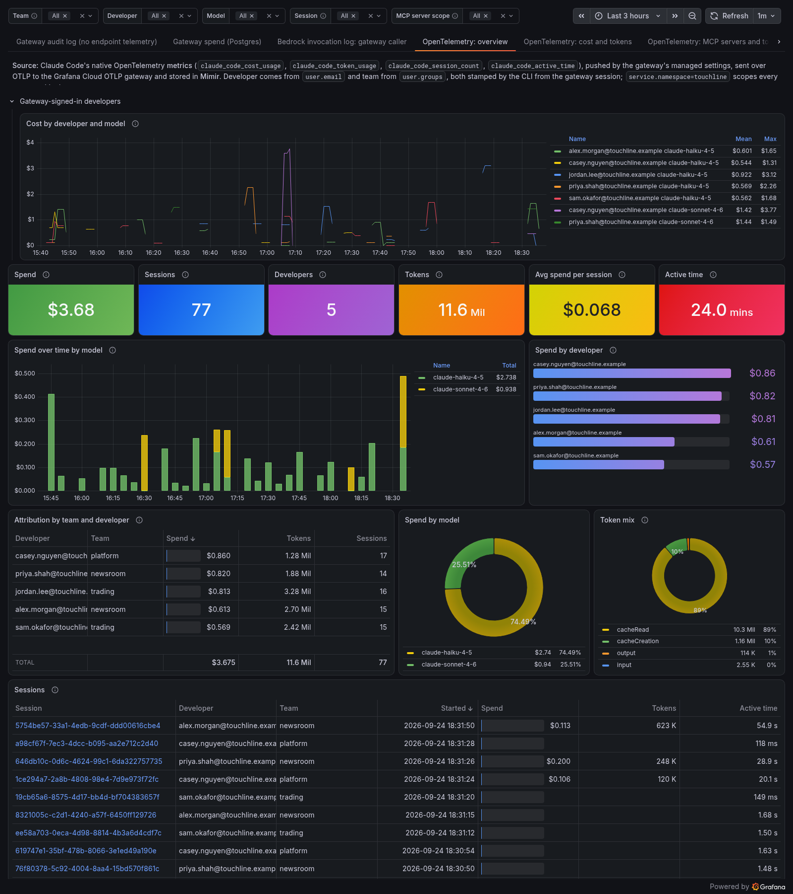
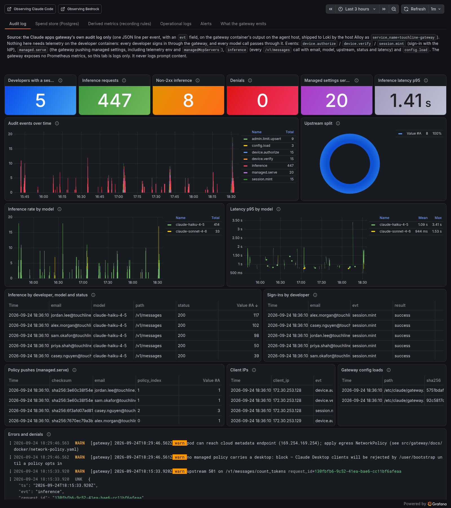
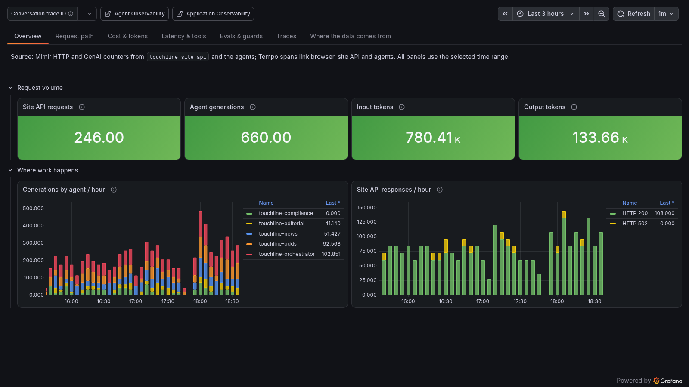
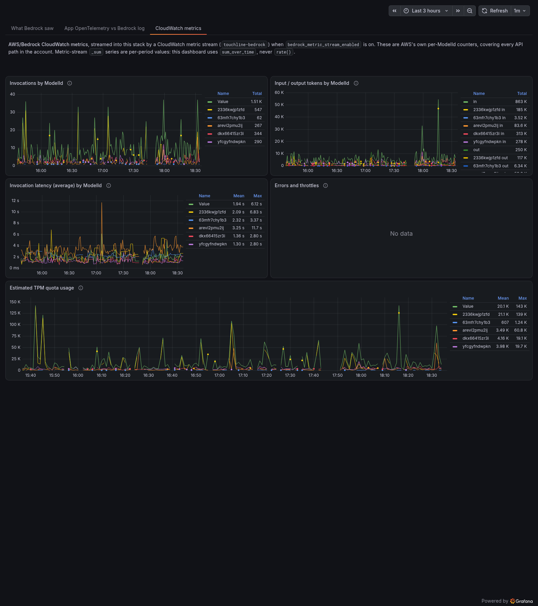

# Demo runbook

A presenter flow in short nudges: what to click, and one line to say. It runs about an hour in
full; a 25-minute cut is at the end. It assumes the demo has been running with traffic on for at
least a few hours, so every panel has history.

The story answers two questions twice, first for developers using a coding agent and then for an
AI feature in your own product:

- Who used the tokens, and what did they cost?
- What did the agent do (tools, MCP), and was it safe?

## Before you start

1. `tofu -chdir=examples/complete output dashboards` and open the four dashboards, signed in to
   the stack. Set the time range to the last 3 hours.
2. Open these alongside them:
   - Alerting > Alert rules, filtered by label `touchline_demo=true`.
   - Observability > Agent (Agent Observability): Agents, Guards, Evaluations, Experiments.
   - Application Observability, filtered to the `touchline` namespace.
   - Frontend Observability, app `touchline-site-web`.
   - Explore on Tempo and Loki.
3. Port-forward the site: `kubectl -n touchline port-forward svc/touchline-site-api 8080:8080` and
   open http://localhost:8080.
4. Check the developers are signed in: the *Gateway audit log* tab should show `session.mint` and
   `inference` events in the last hour. If not, see [coding-agents.md](coding-agents.md).
5. Optional, for the live guard moment: open an SSM shell on the agent host
   (`aws ssm start-session --target $(tofu -chdir=examples/complete output -raw agent_host_instance_id)`).

## Ground rules

- **Two attempts per live action.** If it fails twice, show the same thing from history with its
  real time range. Do not wait on an evaluation score to land; they are asynchronous.
- **Say what is synthetic.** Developer sessions, reader questions and experiment runs are
  generated. The clubs, bookmakers and offers are invented.
- **Costs are estimates.** Claude Code's cost metric, the gateway's spend and the agents' cost
  panels are all priced from token counts, not an AWS bill.
- **Say what is captured.** Content capture is on: prompts and responses are in the logs. Say so,
  and say it is a variable (`content_capture`).

## Part 1: developers and Claude Code

**Context (1 min).** "Five developers in three teams use Claude Code. They never hold an API key
or AWS credential: they sign in to the Claude apps gateway with the company IdP, and the gateway
calls Bedrock for them."

### Observing the Claude apps gateway

| Click | Say |
|---|---|
| *Audit log* tab: sign-ins, inference by developer and model | "Nothing is installed on the developer machines for this tab. Every call goes through the gateway, so we already know who used which model, when, and whether it worked." |
| *Audit log*: policy pushes (`managed.serve`) | "The gateway also pushes settings by team: telemetry, MCP servers, the observability plugin, and which models each team may use. Trading only gets Haiku." |
| *Spend store (Postgres)* tab | "This is the gateway's own spend ledger, queried live through Private Data source Connect. No exporter." |
| *Spend store*: caps vs spend | "Caps are per developer by default, tighter for the trading team and tighter again for one platform developer. Over a cap, the gateway returns a 429 and a message." |
| *Derived metrics (recording rules)* | "The gateway has no Prometheus endpoint. These series are Grafana-managed recording rules over its audit log and database, so we can alert and keep history." |
| *What the gateway emits* | "What it cannot see: tool calls, MCP calls, file edits. For that we need the client's own telemetry." |

**Spend-cap moment.** On *Audit log*, filter inference events to status 429. If the capped
platform developer has hit today's cap, the 429s are there with the blocked message; say "that is
the cap doing its job, per developer, without touching the laptop." If nobody has hit a cap yet,
show the caps table and say when it would trip. Set the caps you want to show before the demo,
not live: an apply to `spend_caps` reaches the host through the agent-host secret and can take up
to 5 minutes to land. The host is not replaced, but the wait is unpredictable mid-demo.

### Observing Claude Code

| Click | Say |
|---|---|
| *OpenTelemetry: overview*, group by team and developer | "Same developers, now from Claude Code's own OpenTelemetry. The gateway pushed the exporter settings; the developer configured nothing." |
| *OpenTelemetry: cost and tokens* | "Tokens by type, including cache reads, and Claude Code's own cost estimate. It should track the gateway ledger; they are two independent paths." |
| *OpenTelemetry: MCP servers and tools* | "Calls and spend per MCP server and tool. Servers pushed by the gateway show as managed. The gateway can hand out MCP servers but cannot see the calls; this can." |
| *OpenTelemetry: prompts and sessions*, pick a session | "One conversation as the developer and the agent had it: prompt, tool results, response. This is content capture, and it is a choice." |
| *OpenTelemetry: hooks, permissions and plugins* | "The observability plugin runs as Claude Code hooks. Every guard decision shows up here as a hook run." |
| *OpenTelemetry: traces*, open one | "Each prompt is a trace: model requests and tool calls as child spans, with time to first token." |
| *OpenTelemetry + Agent Observability plugin* | "The plugin adds a second, independent view: conversations, subagent cost, guard outcomes and evaluation scores." |
| *Bedrock invocation log: gateway caller* | "From Bedrock's side, every developer is one IAM role. Bedrock knows the tokens and the prompt, not the person." (Empty if invocation logging is off; say that is the default.) |

### The PII guard

Agent Observability > Guards. Show the `touchline_claude_code_*` rules and point at
`touchline_claude_code_pii_gate`: a preflight rule that denies a prompt containing a card number,
a US SSN or a UK National Insurance number.

"About one session in five is a PII probe on purpose: a support reply with a card number in it.
The guard denies it before a single token is spent."

Live, from the SSM shell on the agent host:

```bash
cd /etc/agent-host
sudo docker compose exec dev-alex-morgan dev-session /opt/agent-host/prompts/pii-refund-card.txt
```

The result line reports `guard_blocked`. Back in Guards, the deny is at the top of the recent
outcomes. If it does not appear within two attempts, show the deny history from the last day.

Be precise about the other rules: the secret and PII redaction rules and content safety are in
warn mode. Show the redaction on tool content; do not claim prompts are redacted unless you have
checked it on your stack.

### Alerting

Alerting > Alert rules, label `touchline_demo=true`.

| Click | Say |
|---|---|
| *Guard denied a Claude Code prompt* (firing) | "The PII probe trips this unattended. Guard outcomes are metrics, so they alert like anything else." |
| *Developer gateway spend today above 5% of the organization daily cap* (firing) | "Read straight from the gateway's spend table, the same number the gateway enforces. The threshold is low so it fires in a demo." |
| *Claude Code burn rate* and *spend today* rules | "The same idea from Claude Code's own cost metric, per developer." |
| a rule's contact point | "Everything routes to a contact point that delivers nowhere, straight from the rule. The stack's notification policy tree is untouched." |

The gateway dashboard's *Alerts* tab shows the same rules next to the data.

**Hand-off (1 min).** "Same stack, same questions, but now the agent is your own product."

## Part 2: the in-app agents

**Context (1 min).** "Touchline Times has an AI match desk. A reader asks a question; an
orchestrator calls only the specialists it needs: news, odds, editorial, compliance. Compliance
always adds the 18+ and responsible-gambling line. All of it runs on Bedrock through per-team
inference profiles."

| Click | Say |
|---|---|
| The site: ask "Compare the odds for the weekend's big match" | "A real request. The answer comes back with a trace id." |
| Frontend Observability, `touchline-site-web`: the session and `POST /api/picks` | "The browser side: page load, web vitals, and the request that started it all." (If your own session has not landed yet, open one from the synthetic browser job, which runs every 10 minutes, and say so.) |
| Tempo: open that trace | "Browser, site API, Redis cache, orchestrator, the odds agent, Bedrock. Team and agent name are on every span." |
| Application Observability, `touchline` namespace: services and service map | "Rate, errors and duration for every service, with no dashboards built by hand." |
| Knowledge Graph: the demo services | "The graph builds its own call edges from a rule the demo installs." |
| *Observing an agentic app*: *Overview* and *Request path* | "One place for the whole agent system: requests, fan-out, errors." |
| *Cost & tokens* | "Cost by agent, model and team. The orchestrator and editorial use Sonnet; the rest use Haiku, and it shows." |
| *Latency & tools* | "Which tools each agent calls, how long they take, and the simulated failures." |
| Agent Observability > Agents > `touchline-orchestrator` | "Every model call as a generation, grouped into conversations, with three prompt variants rotating through the day as versions." |
| *Evals & guards*, then Evaluations in Agent Observability | "Online evaluations score a sample of live traffic for groundedness, PII and responsible-gambling language. No code change in the app." |
| Guards: `touchline_agents_injected_tool_result` | "Some reader questions smuggle an instruction into a tool result. The guard flags it, in warn mode. Open one: the answer did not follow it." |
| Experiments: the latest scheduled run, then compare two runs | "The same cases against different prompt variants or models, scored by the same evaluator, with cost and duration per case." |
| *Traces* tab | "Every conversation links through to its trace." |

### Observing Bedrock

| Click | Say |
|---|---|
| *CloudWatch metrics* | "AWS's own numbers, streamed in: invocations, latency, tokens, throttles and errors per inference profile." |
| *App OpenTelemetry vs Bedrock log* | "The app's view on the left, Bedrock's on the right. Volume should agree. Bedrock has no idea about conversations, tools or scores." |
| *What Bedrock saw* | "With invocation logging on, Bedrock records every runtime call: prompt, answer, tokens and the region that served it. A cross-region profile means 'somewhere in the geography', not your home region. The IAM role tells you nothing; the inference profile gives team and model." (Empty when logging is off. Say why it is off by default: it is account-wide and captures content.) |

**Close (1 min).** "Two questions, answered twice. For coding agents: the gateway for identity,
caps and cost; Claude Code's telemetry for tools and content; the plugin for guards and
evaluations. For your own agents: OpenTelemetry plus the Agent Observability SDK. And Bedrock's
own view to check both against."

## 25-minute version

1. Gateway: *Audit log*, *Spend store*, *What the gateway emits*.
2. Claude Code: *OpenTelemetry: overview*, *MCP servers and tools*, *prompts and sessions*.
3. The PII guard (history or live) and the firing alerts.
4. The site question, its trace in Tempo, then Agent Observability for the orchestrator.
5. Evaluations and the injection guard.
6. Bedrock: *App OpenTelemetry vs Bedrock log*.

## After the demo

Set `traffic_enabled = false` and apply to stop Bedrock spend while keeping everything deployed,
or destroy it ([teardown.md](teardown.md)).

## Dashboard screenshots

A quick look at each of the four dashboards, for anyone who has not run the demo yet.








