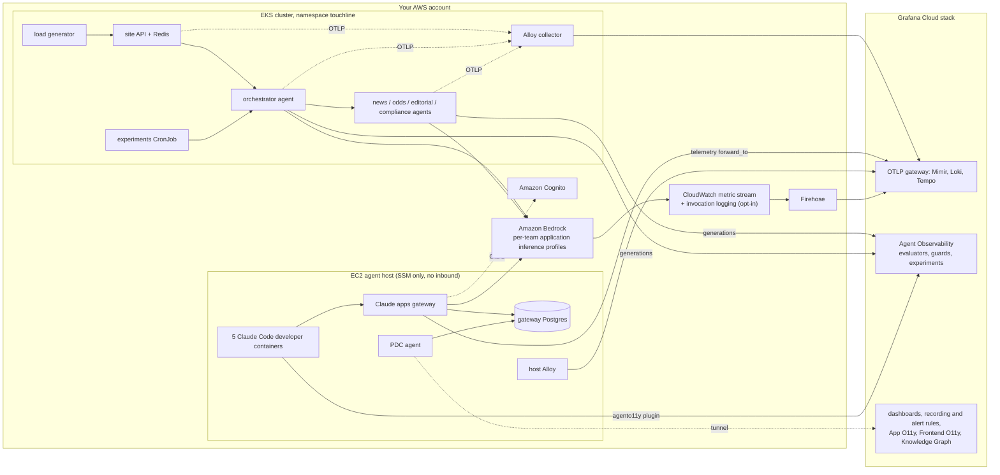

# grafana-aio11y-demo

A self-contained demo of AI observability on Grafana Cloud. One `terraform apply` into your own
AWS account, EKS cluster and Grafana Cloud stack stands up a small AI application, a small team of
Claude Code developers, and Amazon Bedrock's own telemetry, all landing in one Grafana Cloud
stack. One `terraform destroy` removes it.

This is a personal demo project, not an official Grafana Labs product.

## Who this is for

Anyone who wants a working, disposable example of what AI observability on Grafana Cloud looks
like end to end: in-app AI agents, developers using a coding agent through a gateway, and the
underlying model provider's own telemetry, all correlated in the same stack. Useful for a
presenter preparing a demo, or as a reference architecture to copy pieces from.

## What it demonstrates

### In-app agents on Amazon Bedrock

Touchline Times, a fictional sports newspaper, has an AI
match desk: an orchestrator routes a reader question to news, odds, editorial and compliance
agents, which call shared tools (odds, news, head-to-head history, offers) and answer through
Bedrock. Every call is traced with OpenTelemetry and recorded as a generation in Grafana Agent
Observability, with online evaluations (groundedness, PII, responsible-gambling language), a
prompt-injection guard on tool results and scheduled experiments comparing prompt variants and
models.

### Claude Code developers through the Claude apps gateway

Five developers in three teams
(newsroom, trading, platform) run Claude Code in containers on one EC2 host. They sign in to the
Claude apps gateway with Amazon Cognito, and the gateway holds the Bedrock credential, decides
which models each team can use, enforces per-organization, per-team and per-developer spend caps,
and pushes managed settings: OpenTelemetry export, MCP servers and the Agent Observability plugin.
The plugin sends every prompt and tool call through Cloud guards (a PII deny guard, secret and PII
redaction, content safety) and makes sessions available to online evaluations.

### Bedrock's own view

A CloudWatch metric stream sends the `AWS/Bedrock` namespace to Grafana
Cloud Metrics, and optional model invocation logging sends Bedrock's per-call log to Grafana Cloud
Logs. Per-team application inference profiles make AWS-side attribution possible without the
gateway.

### Everything in one Grafana Cloud stack

Four dashboards (in-app agents, Bedrock, Claude Code,
the gateway), each tab labelled by the data source behind it; Grafana-managed recording and alert
rules (spend, guard denies, errors, latency, throttling) on simplified routing to a contact point
that pages nobody; a spend datasource that reads the gateway's own Postgres through Private Data
Source Connect; Application Observability, Frontend Observability for the site and a Knowledge
Graph rule that joins the services.

## Architecture

More detail, including per-component diagrams, in [Architecture](architecture.md).

## Quick links

- [Getting started](getting-started.md): prerequisites, then a ten-minute quickstart
- [Architecture](architecture.md): components, data paths, naming
- [Data source tiers](data-sources.md): what each telemetry tier sees, mapped to dashboard tabs
- [Demo runbook](demo-runbook.md): a presenter flow with what to click and what to say
- [Coding agents and the gateway](coding-agents.md): the agent host, sign-in, developers, teams and spend caps
- [Deploy alternatives](deploy-alternatives.md): Argo CD, Flux or kubectl for the workloads
- [Security](security.md): content capture, tokens in state, exposure, guard scope
- [Cost](cost.md): what it costs to run and how to cap it
- [Troubleshooting](troubleshooting.md)
- [Teardown](teardown.md)
- [Reference: Terraform inputs and outputs](reference-terraform.md)
- [Reference: Helm chart values](reference-helm.md)

## Licence

Apache-2.0. Source and issues: [GitHub](https://github.com/rknightion/grafana-aio11y-demo).
